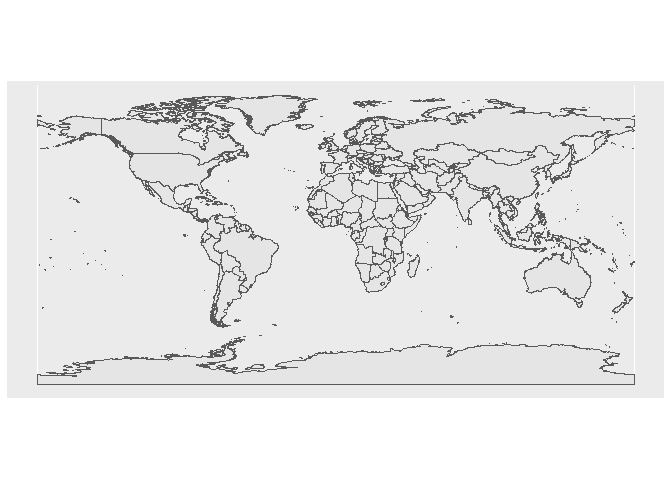
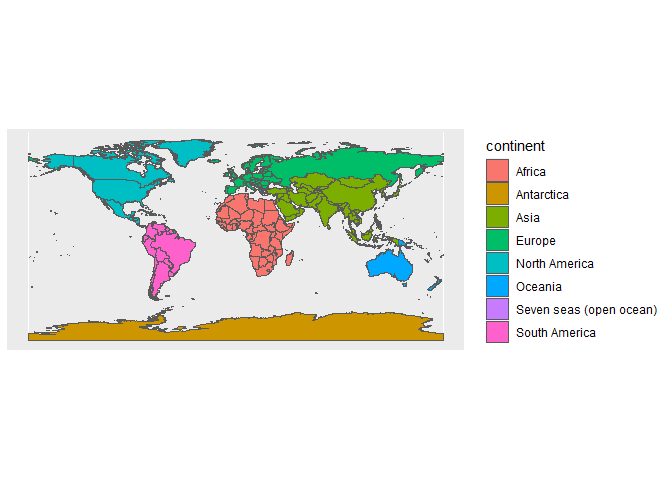
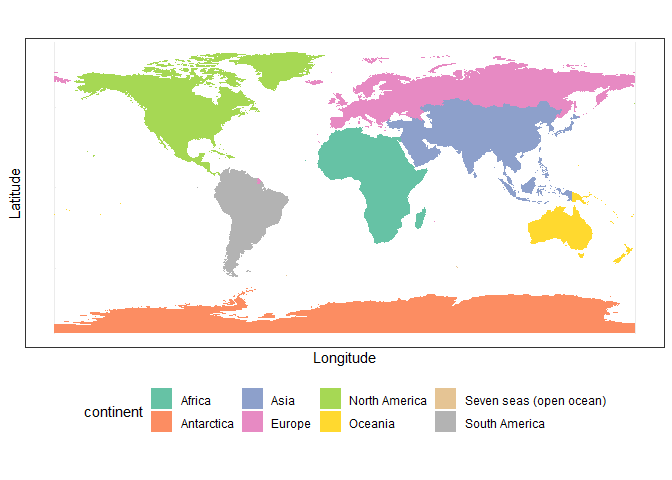
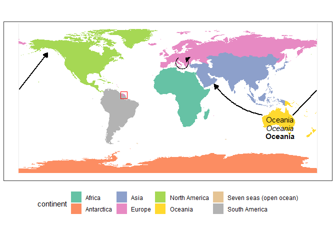
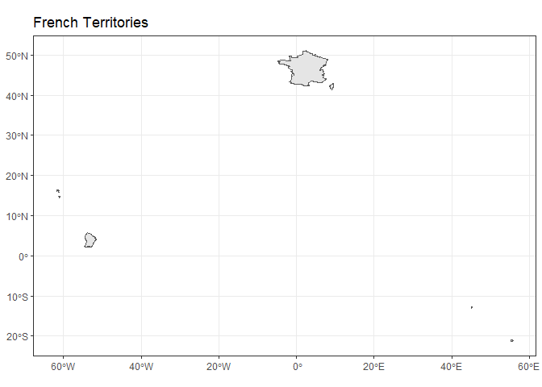
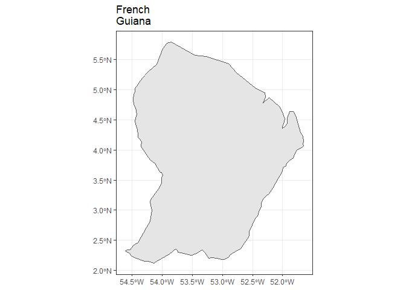
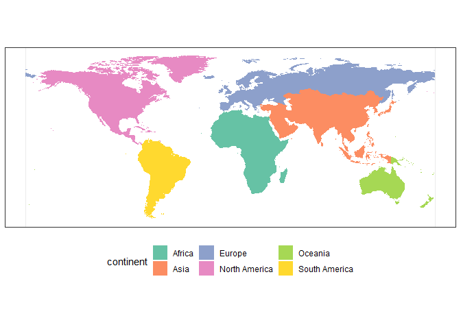
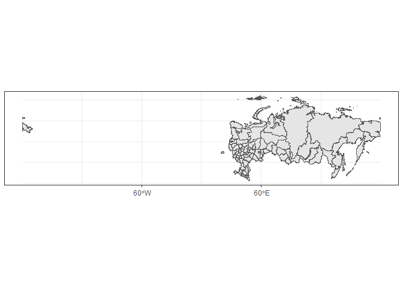
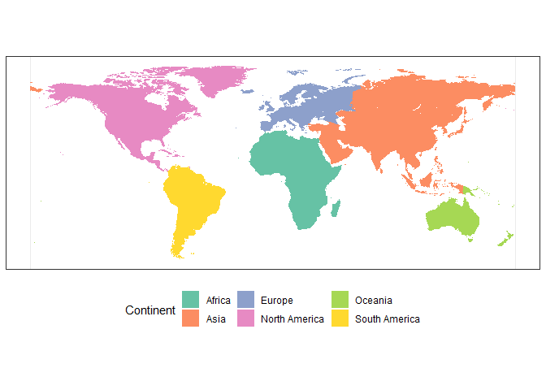

Maps with ggplot2
================
Thomas Carlin
2022-04-27

``` r
knitr::opts_chunk$set(fig.path='Figs/')
```

# Summary

This guide will provide a brief introduction to creating and annotating
maps in ggplot2. This guide is neither exhaustive nor claims to be the
most optimal/efficient way to generate maps, however is provided as a
natural starting point to producing high quality maps. Any
corrections/suggestions can be sent to <tom.carlin@scionresearch.com>

## Load Required Libraries

A number of libraries are called by this guide, however not all are
required for producing simple maps. A brief description of each
libraries purpose is provided.

``` r
library(maptools) # For map functions
library(maps) # For map data
library(ggplot2) # For plotting
library(sf) # For plotting and manipulating spatial objects
library(rnaturalearth) # For high res country data
library(rnaturalearthdata) # Data for rnaturalearth package
library(rnaturalearthhires) # For high res region data (for Russia splitting)
library(ggforce) # For circular arrows
```

## Download Global Data

This guide relies on data downloaded from the “rnaturalearthdata”
package, which includes a large amount of data including ISO codes,
continents, country names, as well as the information for drawing the
shapefiles. For simpler country outlines, you can use the “wrld_simpl”
data from the maptools package.

The data downloaded has two classes: “sf” and “data.frame”

``` r
world <- ne_countries(scale = "medium", returnclass = "sf") # Download data on countries in mercator projection
class(world) ## Check the class of the downloaded data
```

    ## [1] "sf"         "data.frame"

## Basic Plot

Immediately, we can produce a basic world map with ggplot default
display options.

``` r
ggplot(data = world) + # Tells ggplot what dataset we're using
  geom_sf() # Draws shapefiles
```

<!-- -->

### Adding Colour

Often, we wish to use colour to convey data in our figures. We can add a
new function to begin detailing the aesthetic of our map: aes()

By including a “fill” argument within the aes() function we can add
colour to our map. We simply need to indicate which data dictates the
application of colour to areas of the map.

``` r
names(world)
```

    ##  [1] "scalerank"  "featurecla" "labelrank"  "sovereignt" "sov_a3"    
    ##  [6] "adm0_dif"   "level"      "type"       "admin"      "adm0_a3"   
    ## [11] "geou_dif"   "geounit"    "gu_a3"      "su_dif"     "subunit"   
    ## [16] "su_a3"      "brk_diff"   "name"       "name_long"  "brk_a3"    
    ## [21] "brk_name"   "brk_group"  "abbrev"     "postal"     "formal_en" 
    ## [26] "formal_fr"  "note_adm0"  "note_brk"   "name_sort"  "name_alt"  
    ## [31] "mapcolor7"  "mapcolor8"  "mapcolor9"  "mapcolor13" "pop_est"   
    ## [36] "gdp_md_est" "pop_year"   "lastcensus" "gdp_year"   "economy"   
    ## [41] "income_grp" "wikipedia"  "fips_10"    "iso_a2"     "iso_a3"    
    ## [46] "iso_n3"     "un_a3"      "wb_a2"      "wb_a3"      "woe_id"    
    ## [51] "adm0_a3_is" "adm0_a3_us" "adm0_a3_un" "adm0_a3_wb" "continent" 
    ## [56] "region_un"  "subregion"  "region_wb"  "name_len"   "long_len"  
    ## [61] "abbrev_len" "tiny"       "homepart"   "geometry"

``` r
table(world$continent)
```

    ## 
    ##                  Africa              Antarctica                    Asia 
    ##                      54                       1                      53 
    ##                  Europe           North America                 Oceania 
    ##                      50                      38                      24 
    ## Seven seas (open ocean)           South America 
    ##                       8                      13

Here, we will apply colour based on the continent a country is in.

``` r
ggplot(data = world) + # Tells ggplot what dataset we're using
  geom_sf() + # Draws shapefiles
  aes(fill = continent) #
```

<!-- -->

### Borders, Coordinates, Colour, Legend

There are almost unlimited changes we can make to the aesthetic of our
map. Here are a few more.

``` r
Palette <- c('#66c2a5','#fc8d62','#8da0cb','#e78ac3','#a6d854','#ffd92f',"#e5c494", "#b3b3b3") # Manual colour palette

theme_set(theme_bw()) ## Set the default figure background to be Black + White (provides clear white background)

ggplot(data = world) +
  geom_sf(color=NA) + # Removes country borders
  xlab("Longitude") + ylab("Latitude") + # Adds axes labels
  aes(fill = continent) + 
  scale_fill_manual(values=Palette) + # Alternate colour option (based on personal construction of "Palette")
  theme(legend.position="bottom")  ## Moves legend to bottom
```

<!-- -->

#### Specifying colours

Hex Codes, and advice on colourblind friendly colour schemes can be
found on <https://colorbrewer2.org/>

Premade colour sets can be used like so:
`scale_fill_brewer(palette="Set1")`

#### Axes options

Axes can be modified using `scale_y_continuous()` and
`scale_x_continuous()`, or can be removed entirely using the line:
`theme(axis.text.x=element_blank(), axis.ticks.x=element_blank(), axis.title.x=element_blank(), axis.text.y=element_blank(), axis.ticks.y=element_blank(), axis.title.y=element_blank())`

## Annotating Maps: Text, Lines, Arrows (Straight, Curved, Circular), and Points

We have a lot of freedom to draw, write, and otherwise draw attention to
areas of our maps. We simply need to provide the coordinates of where we
wish to place these objects.

-   Text: `annotate("text", x = 0, y = 0, label = "Example")`
-   Lines: `geom_segment(aes(x = 0, y = 10, xend = 0, yend =10))`
    -   Alternatively:
        `annotate("segment", x = 0, xend = 10, y = 0, yend = 10)`
    -   Straight Arrows:
        `geom_segment(aes(x = 0, y = 10, xend = 0, yend = 10),  arrow = arrow(length = unit(0.03, "npc"), type="closed"),)`
-   Circles: `geom_circle(aes(x0 = 0, y0 = 0, r = 7.5))`
    -   Circle Segments:
        `geom_arc(aes(x0 = 0, y0 = 0, r = 7.5,start = 0, end = 2 * pi),)`
    -   Circular Arrows:
        `geom_arc(aes(x0 = 19, y0 = 7, r = 7.5,start = -0.2*pi, end = -1.8 * pi),arrow = arrow(length = unit(0.03, "npc"), type="closed",angle=45, ends="last"))`
-   Curved Lines:
    `geom_curve(aes(x = -20, y = -20, xend = -30, yend = -30), angle = 90)`
    -   Curved Arrows:
        `geom_curve(aes(x = -55, y = -35, xend = 5, yend = -20), arrow = arrow(length = unit(0.03, "npc"), type="closed"), angle = 90)`
-   Points: `geom_point(x= 50, y=50)`
-   Rectangles:
    `annotate("rect", xmin = -10, xmax = 10, ymin = -10, ymax = 10, alpha = .2)`
    -   “alpha” argument indicates opacity. A value of 0.2 will produce
        a mostly see through rectangle

``` r
Palette <- c('#66c2a5','#fc8d62','#8da0cb','#e78ac3','#a6d854','#ffd92f',"#e5c494", "#b3b3b3") # Manual colour palette

theme_set(theme_bw())

ggplot(data = world) +
  geom_sf(color=NA) + 
  aes(fill = continent) + 
  scale_fill_manual(values=Palette) + 
  theme(legend.position="bottom", axis.text.x=element_blank(), axis.ticks.x=element_blank(), 
    axis.title.x=element_blank(), axis.text.y=element_blank(), axis.ticks.y=element_blank(),
    axis.title.y=element_blank()) +
  annotate("text", x = 135, y = -25, label = "Oceania") +
  annotate("text", x = 135, y = -45, label = "Oceania", fontface = 'bold') +
  annotate("text", x = 135, y = -35, label = "Oceania", fontface = 'italic') +
  geom_curve(aes(x = 114, y = -20, xend = 56, yend = 17),arrow = arrow(length = unit(0.03, "npc"), 
    type="closed"), colour = "#000000", size = 0.8, angle = 90, curvature = -0.2) +
  geom_segment(aes(x = 150, y = -20, xend = 179, yend = 10), colour = "#000000", size = 0.8) + 
    # Line segments can create the illusion that arrows wrap across map boundaries.
  geom_segment(aes(x = -179, y = 11, xend = -145, yend = 55), arrow = arrow(length = unit(0.03, "npc"),
    type="closed"), colour = "#000000", size = 0.8) + 
  geom_arc(aes(x0 = 17, y0 = 43, r = 7.5, start = -0.2*pi, end = -1.8 * pi), 
    arrow = arrow(length = unit(0.03, "npc"), type="closed", angle=45, ends="last"), 
    colour = "#000000", size = 0.55) +
  annotate("rect", xmin = -57, xmax = -49, ymin = 0, ymax = 8, color="red", alpha=0)
```

<!-- -->

## Modifying Countries

Often with maps we don’t need to display the whole world, or we may wish
to modify how some countries are represented. Despite colouring our maps
according to continent, you’ll notice I highlighted on the map above
(with a red rectangle) that French Guiana is coloured differently than
the rest of South America.

This is due to French Guiana being recognised as part of mainland
France, and hence Europe. France is a multipolygon object within our
`world` object. This means that mainland France + French Guiana are
drawn by separate polygons. Therefore we can split these polygons up,
and modify the associated data.

We may wish to make other minor changes, such as removing Antarctica or
“Seven Seas” as a continent option. All of this can be quickly achieved
by modifying the data we plot.

``` r
## Fix French Guiana - it is currently displayed as part of mainland France. Needs splitting.
FRA <- world[73,] # Isolate France row
split <- st_cast(FRA, "POLYGON") # Split multipolygon into many polygons

ggplot(data = FRA) + # Plot confirming correct polygons (row 3 is French Guiana, row 10 is mainland France)
  geom_sf() +
  ggtitle("French Territories") # Adding a Title 
```

<!-- -->

``` r
ggplot(data = split[3,]) + # Plot confirming correct polygons (row 3 is French Guiana, row 10 is mainland France)
  geom_sf() +
  ggtitle("French\nGuiana") # Adding a Title - "\n" adds a line break
```

<!-- -->

``` r
guy <- split[3,] # Isolate polygon for French Guiana
FRA_main <- split[10,] # Isolate polygon for mainland France
```

We have identified which row relates to French Guiana (creating object
`guy`), and can assign it new values.

``` r
## Give French Guiana new values to differentiate it from mainland France.
guy$admin <- "French Guiana"
guy$continent <- "South America"

## We can now replace all French polygons on main map with these 2 separate polygons. Other territories (e.g. French Polynesia) are too small to be viewed so can be ignored (depending on your map's purpose).
baguetteless <- world[world$sovereignt!="France",]
world2 <- rbind(baguetteless, FRA_main, guy)

## Remove Antarctica & Seven seas (open ocean)
world2 <- world2[world2$continent!="Antarctica",]
world2 <- world2[world2$continent!="Seven seas (open ocean)",]
```

Now that we have modified our `world` object (creating `world2`) to
properly assign French Guiana it’s continent information we can simply
plot again.

``` r
Palette <- c('#66c2a5','#fc8d62','#8da0cb','#e78ac3','#a6d854','#ffd92f',"#e5c494", "#b3b3b3") # Manual colour palette

theme_set(theme_bw())

ggplot(data = world2) +
  geom_sf(color=NA) + 
  aes(fill = continent) + 
  scale_fill_manual(values=Palette) + 
  theme(legend.position="bottom", axis.text.x=element_blank(), axis.ticks.x=element_blank(), 
    axis.title.x=element_blank(), axis.text.y=element_blank(), axis.ticks.y=element_blank(),
    axis.title.y=element_blank())
```

<!-- -->

### Splitting Russia

Similarly, as Russia is so large we may wish to split Russia into both
European + Asian components. As mainland Russia is drawn as a single
polygon (mostly), we cannot simply split the polygons up and assign new
data to each.

The solution is to download higher resolution country data to identify
the different regions of Russia, and then modify the data of individual
regions. We can achieve this by using the `rnaturalearthhires` package.

``` r
## Download High Resolution Country Data
rus <- ne_states(country = "Russia", returnclass = "sf")

ggplot(data = rus) + # Plot confirming Russian polygons work
  geom_sf() 
```

<!-- -->

Let’s divide Russia’s main regions (Central, Far Eastern, Northwestern,
Siberian, Urals, Volga) along the Ural mountains. First, we need to
create a column for continent information as this is not part of the
initial downloaded information.

``` r
rus$continent <- NA
names(rus)
```

    ##  [1] "featurecla" "scalerank"  "adm1_code"  "diss_me"    "iso_3166_2"
    ##  [6] "wikipedia"  "iso_a2"     "adm0_sr"    "name"       "name_alt"  
    ## [11] "name_local" "type"       "type_en"    "code_local" "code_hasc" 
    ## [16] "note"       "hasc_maybe" "region"     "region_cod" "provnum_ne"
    ## [21] "gadm_level" "check_me"   "datarank"   "abbrev"     "postal"    
    ## [26] "area_sqkm"  "sameascity" "labelrank"  "name_len"   "mapcolor9" 
    ## [31] "mapcolor13" "fips"       "fips_alt"   "woe_id"     "woe_label" 
    ## [36] "woe_name"   "latitude"   "longitude"  "sov_a3"     "adm0_a3"   
    ## [41] "adm0_label" "admin"      "geonunit"   "gu_a3"      "gn_id"     
    ## [46] "gn_name"    "gns_id"     "gns_name"   "gn_level"   "gn_region" 
    ## [51] "gn_a1_code" "region_sub" "sub_code"   "gns_level"  "gns_lang"  
    ## [56] "gns_adm1"   "gns_region" "min_label"  "max_label"  "min_zoom"  
    ## [61] "wikidataid" "name_ar"    "name_bn"    "name_de"    "name_en"   
    ## [66] "name_es"    "name_fr"    "name_el"    "name_hi"    "name_hu"   
    ## [71] "name_id"    "name_it"    "name_ja"    "name_ko"    "name_nl"   
    ## [76] "name_pl"    "name_pt"    "name_ru"    "name_sv"    "name_tr"   
    ## [81] "name_vi"    "name_zh"    "ne_id"      "geometry"   "continent"

``` r
rus[rus$region=="Central"|rus$region=="Volga"|rus$region=="Northwestern",85] <- "Europe"
rus[rus$region=="Far Eastern"|rus$region=="Siberian"|rus$region=="Urals",85] <- "Asia"
```

Now that we have assigned continent information for each region of
Russia, we need to remove the Russian country information from the
original dataframe, and replace it with the new regional information.
For this, we need to ensure column names align between the two
dataframes `rus` and `world2` - the easiest way to complete this is to
remove extraneous columns.

``` r
norus <- world2[world2$sovereignt!="Russia",]

names(norus)
```

    ##  [1] "scalerank"  "featurecla" "labelrank"  "sovereignt" "sov_a3"    
    ##  [6] "adm0_dif"   "level"      "type"       "admin"      "adm0_a3"   
    ## [11] "geou_dif"   "geounit"    "gu_a3"      "su_dif"     "subunit"   
    ## [16] "su_a3"      "brk_diff"   "name"       "name_long"  "brk_a3"    
    ## [21] "brk_name"   "brk_group"  "abbrev"     "postal"     "formal_en" 
    ## [26] "formal_fr"  "note_adm0"  "note_brk"   "name_sort"  "name_alt"  
    ## [31] "mapcolor7"  "mapcolor8"  "mapcolor9"  "mapcolor13" "pop_est"   
    ## [36] "gdp_md_est" "pop_year"   "lastcensus" "gdp_year"   "economy"   
    ## [41] "income_grp" "wikipedia"  "fips_10"    "iso_a2"     "iso_a3"    
    ## [46] "iso_n3"     "un_a3"      "wb_a2"      "wb_a3"      "woe_id"    
    ## [51] "adm0_a3_is" "adm0_a3_us" "adm0_a3_un" "adm0_a3_wb" "continent" 
    ## [56] "region_un"  "subregion"  "region_wb"  "name_len"   "long_len"  
    ## [61] "abbrev_len" "tiny"       "homepart"   "geometry"

``` r
## Need to match colnames of rus and norus for rbind to work.
norus <- norus[,c(18,55,64)] # Remove extraneous columns
colnames(norus) <- c("Name","Continent","geometry") # Rename remaining columns consistently
rus <- rus[,c(9,85,84)]
colnames(rus) <- c("Name","Continent","geometry")

world3 <- rbind(norus,rus)
world3 <- world3[!is.na(world3$Continent),] # Remove any NAs
```

Now that we have modified our `world` object (creating `world3`) to
split Russia into regional components we can simply plot again.

``` r
Palette <- c('#66c2a5','#fc8d62','#8da0cb','#e78ac3','#a6d854','#ffd92f',"#e5c494", "#b3b3b3") # Manual colour palette

theme_set(theme_bw())

ggplot(data = world3) +
  geom_sf(color=NA) + 
  aes(fill = Continent) + 
  scale_fill_manual(values=Palette) + 
  theme(legend.position="bottom", axis.text.x=element_blank(), axis.ticks.x=element_blank(), 
    axis.title.x=element_blank(), axis.text.y=element_blank(), axis.ticks.y=element_blank(),
    axis.title.y=element_blank())
```

<!-- -->
